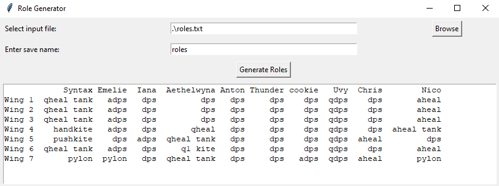

# GW2-Raid-Role-Randomizer

The Raid Role Randomizer is a third-party, external tool for Guild Wars 2, which lets you randomize the main squad composition of your raid squad. Download the current version from the [release](https://github.com/BKris2315/GW2-Raid-Role-Randomizer/releases/tag/release) page.

Features:
- it assures to have in your squad 2 healers (one tank), 2 support dps and 6 dps
- it assures to have in your squad special roles, such as tower (W3), hand kite (W4), Qadim 1 kite (W6), 3 pylons (W7)
- save your composition to a ```.xlsx``` sheet. The sheet will be generated in the folder, where you have your ```.exe``
- custom roles for each team member

  ## Tutorial and explanation

The usage of the tool is very straightforward. Download the current version and make sure you have next to the ```.exe``` the two ```.csv``` files: ```role_nr_per_wing.csv``` and ```spec_role_nr_per_wing.csv```. You don't have to worry about them. These contain the number of roles you need in each wing, including the currently supported special roles.

Make sure you have on your PC, preferably next to the ```.exe``` a ```.txt``` file with the roles of each one of your players. The format has to be like this:

```
~Syntax~
Wing 1
- VALE GUARDIAN: aheal, qheal, aheal tank, qheal tank, qdps
- GORSEVAL: aheal, qheal, aheal tank, qheal tank, qdps
- SABETHA: aheal, qheal, aheal tank, qheal tank, qdps
```

For a blank template see the ```role_template_full_example.txt``` file. Download it and ask your party to delete the roles, they don't want to play or can't play, and then copy each of the player's data into one file. This has to contain 10 names and below each name there have to be listed 7 wings, with the specified bosses in the template and at least one role next to each boss, otherwise, the tool won't work.

### Note
You can bug the tool since it currently doesn't fool checks if the roles you input can be randomized into a valid realization. Meaning, you have to make sure, that your composition has enough roles from everything.

Once these preparation works have been done, you can double-click the ```.exe``` and a very simple and straightforward menu welcomes you:



**Options:**

- in the line 'Select input file' -> Browse, you can select your file with the roles of your squad if it is not named as default ```roles.txt``` and is not next to your ```.exe```
- 'Enter save name': enter the save name for your ```.xlsx``` sheet. You don't have to specify the format, only the name. Example: ```my_test_roles```
- Clicking 'Generate roles' will generate a set of random roles, save it the ```.xlsx``` sheet with the save name specified, and display the current assignments in a small window below the button. Pressing it again will repeat the same. Always the last assignment gets saved, if you don't change the save name.

If you have any comments, or requests, or notice any bugs you can let me know about them here on GitHub, in-game (SaigoRyuu.5196), or on Discord (syntaxerror2315). 

For the programmers: the whole project was created using Python.

## Cheers, happy raiding! :tada:
  
